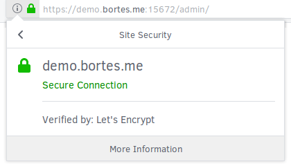

# Instalar RabbitMQ

Instalação do RabbitMQ versão 3.6.12.

Habilitar o uso do protocolo [STOMP](http://stomp.github.io/).

## Requisitos

+ 8 GB de RAM e 16 GB de espaço em disco - utilizando regra [sugerido aqui](https://www.rabbitmq.com/production-checklist.html)
+ Ubuntu 16.04 LTS ou superior
+ Docker CE 18.03.0 ou superior
+ Docker Compose 1.21.0 ou superior
+ Certbot 0.22.2 ou superior

## TL;DR

Para facilitar, execute [este shell script](./FILES/run.sh) que contém deste manual:

```bash
$ curl https://github.com/bortes/wiki/blob/master/RABBITMQ/FILES/run.sh | sudo bash
```

## Por que

Porque ele é um _message broker_ completo e fácil de [gerenciar](https://www.rabbitmq.com/configure.html), de escalar quando [clusterizado](https://www.rabbitmq.com/clustering.html), que possui vários [plugins](https://www.rabbitmq.com/plugins.html) e ainda é gratuíto.

Outras opções para mensageria são:

+ [RabbitMQ as a Service](https://www.cloudamqp.com/)
+ [IBM MQ](https://www.ibm.com/us-en/marketplace/secure-messaging)
+ [Azure Service Bus](https://docs.microsoft.com/en-us/azure/service-bus-messaging/service-bus-fundamentals-hybrid-solutions)
+ [Amazon Simple Queue Service (SQS)](https://aws.amazon.com/sqs/)
+ [Apache Kafka](http://kafka.apache.org/)
+ [ZeroMQ](http://zeromq.org/)
+ [Redis](https://redis.io/) - na verdade ele não foi criado para ser _message broker_, mas é possível [configurar](https://medium.com/@weyoss/building-a-simple-message-queue-using-redis-server-and-node-js-964eda240a2a) ou trabalhar com [pub/sub](https://redis.io/topics/pubsub)

## Repositório

As configurações deverão ser salvas em **/etc/opt/rabbitmq**.

```bash
$ sudo mkdir -p /etc/opt/rabbitmq
```

## Instalação

> &nbsp;
> Iremos no conectar ao RabbitMQ via TLS e para tanto devemos [criar um certificado](../TLS/README.md) para o DNS **demo.bortes.me**.
> &nbsp;

Instalaremos o RabbitMQ via Docker, pois desta forma simplificamos a instalação do mesmo.

Também iremos habilitar os seguintes plugins:

+ rabbitmq_management, [Management Plugin](https://www.rabbitmq.com/management.html)
+ rabbitmq_web_stomp, [Web STOMP Plugin](https://www.rabbitmq.com/web-stomp.html)

## Otimização

Abaixo regras para otimizar o desempenho do RabbitMQ.

### memória

Vamos modificar a quantidade de memória utilizada pelo RabbitMQ.

Para tanto, iremos alterar as configurações **vm\_memory\_high\_watermark.relative** e **vm\_memory\_high\_watermark\_paging\_ratio**.

A primeira define a quantidade limite de memória utilizado pelo RabbitMQ antes que ele interrompa a troca de mensagens.

E a segunda determina a taxa de memória que será utilizada antes dos dados serem páginados em disco.

```ini
vm_memory_high_watermark.relative = 0.4
vm_memory_high_watermark_paging_ratio = 0.75
```

Nesta regra indicamos que o RabbitMQ utilizará até 40% da memória disponível. Desta quantidade, quando o consumo for superior à 75% os dados serão paginados em disco.

_Fonte: [Memory Alarms](https://www.rabbitmq.com/memory.html)_

### disco

Vamos modificar o espaço em disco utilizado pelo RabbitMQ.

Para tanto, iremos alterar a configuração **disk\_free\_limit.relative**.

Ela define o armazenamento em dispo utilizado pelo RabbitMQ antes que ele pare de receber novas mensagens (bloqueando os publicadores).

```ini
disk_free_limit.relative = 1.5
```

Nesta regra indicamos que o RabbitMQ utilizará um armazenamento em disco equivalente à 150% da memória disponível.

_Fonte: [Disk Space](https://www.rabbitmq.com/production-checklist.html#resource-limits-disk-space)_

### arquivos abertos

Vamos modificar a quantidade de arquivos que podem ser abertos pelo RabbitMQ.

Para tanto, iremos alterar o _file descriptor_.

Ele define a quantidade de arquivos (conexões, mensagens e filas) que podem ser abertos pelo RabbitMQ.

Nesta regra indicamos que o RabbitMQ abra até 51.200 (50k).

> &nbsp;
> Outra opção é multiplicar o total de filas mais 2 por 95% do número de conexões simultâneas esperadas.
> &nbsp;

_Fonte: [Open File Handles Limit](https://www.rabbitmq.com/production-checklist.html#resource-limits-file-handle-limit)_

### rede

Considere modificar os parâmetros em nível do protocolo da rede utilizada pelo RabbitMQ.

_Fonte: [Networking and RabbitMQ](https://www.rabbitmq.com/networking.html)_

## Configuração

Como modelo de configuração podemos utilizar o [rabbitmq.config.example](https://github.com/rabbitmq/rabbitmq-server/blob/master/docs/rabbitmq.config.example).

_**ATENÇÃO**: por segurança, ALTERE AS PORTAS de acesso!_

_**IMPORTANTE**: é preciso habilitar o acesso externo as portas 5672, 15672 e 15676!_

Primeiro, vamos criar o arquivo responsável por definir os plugins que serão ativados em _/etc/opt/rabbitmq/enabled_plugins_ com o seguinte conteúdo:

```erlang
[
  %% https://www.rabbitmq.com/management.html
  rabbitmq_management, 
  %% https://www.rabbitmq.com/web-stomp.html
  rabbitmq_web_stomp
].
```

Depois, o arquivo de configuração em _/etc/opt/rabbitmq/rabbitmq.config_ com o seguinte conteúdo:

```erlang
%% https://www.rabbitmq.com/configure.html
[
  {
    rabbit, [
      %% https://www.rabbitmq.com/configure.html#config-file
      { loopback_users, [ ] },
      %% https://www.rabbitmq.com/ssl.html
      { ssl_listeners, [ ] },
      %% https://www.rabbitmq.com/configure.html#config-items
      { tcp_listeners, [ 5672 ] },
      { vm_memory_high_watermark, 0.4 },
      { vm_memory_high_watermark_paging_ratio, 0.75 },
      { disk_free_limit, {mem_relative, 1.5} }
    ]
  },
%% https://www.rabbitmq.com/management.html
  {
    rabbitmq_management, [
      %% https://www.rabbitmq.com/management.html#load-definitions
      { load_definitions, "/etc/rabbitmq/definitions.json" },
      %% https://www.rabbitmq.com/management.html#path-prefix
      { path_prefix, "/admin" },
      %% https://www.rabbitmq.com/management.html#web-dispatch-config
      { listener, [
        { port, 15672 },
        { ssl, true },
        { ssl_opts, [
          { cacertfile, "/certs/demo.bortes.me/ca.pem" },
          { certfile,   "/certs/demo.bortes.me/cert.pem" },
          { keyfile,    "/certs/demo.bortes.me/key.pem" }
        ]}
      ] }
    ]
  },
%% https://www.rabbitmq.com/web-stomp.html
  {
    rabbitmq_web_stomp, [
      { ssl_config, [
        { port, 15676 },
        { cacertfile, "/certs/demo.bortes.me/ca.pem" },
        { certfile,   "/certs/demo.bortes.me/cert.pem" },
        { keyfile,    "/certs/demo.bortes.me/key.pem" },
        { password,   "" }
      ] }
    ]
  }
].
```

Em seguida, o arquivo de configurações do Management Plugin em _/etc/opt/rabbitmq/definitions.json_ com o seguinte conteúdo:

```javascript
{
   "rabbit_version":"3.6.9",
   "users":[
      {
         "name": "guest",
         "password_hash": "woB0BsZLuZ1Y/lv8euzdzhbmX05Aaxh4ExVpr6gyRGlc9h/j",
         "hashing_algorithm": "rabbit_password_hashing_sha256",
         "tags": "administrator"
      }
   ],
   "vhosts":[
      {
         "name":"/"
      }
   ],
   "permissions":[
      {
         "user": "guest",
         "vhost":"/",
         "configure":".*",
         "write":".*",
         "read":".*"
      }
   ],
   "parameters":[
   ],
   "global_parameters":[
      {
         "name":"cluster_name",
         "value":"meu@cluster"
      }
   ],
   "policies":[
   ],
   "queues":[
   ],
   "exchanges":[
   ],
   "bindings":[
   ]
}
```

## Execução

Por fim, o arquivo para execução do RabbitMQ com _contêiner_ em _/etc/opt/rabbitmq/docker-compose.yml_ com o seguinte conteúdo:

```yaml
version: '2'

volumes:
  rabbit_logs:
  rabbit_data:

services:
  server:
    image: rabbitmq:alpine
    ports:
      - "5672:5672"
      - "15672:15672"
      - "15676:15676"
    restart: on-failure
    ulimits:
      nofile:
        soft: 51200
        hard: 51200
    volumes:
      - rabbit_logs:/var/log/rabbitmq
      - rabbit_data:/var/lib/rabbitmq
      - /etc/opt/rabbitmq/enabled_plugins:/etc/rabbitmq/enabled_plugins
      - /etc/opt/rabbitmq/rabbitmq.config:/etc/rabbitmq/rabbitmq.config
      - /etc/opt/rabbitmq/definitions.json:/etc/rabbitmq/definitions.json
      - /etc/letsencrypt/live/demo.bortes.me/chain.pem:/certs/demo.bortes.me/ca.pem
      - /etc/letsencrypt/live/demo.bortes.me/fullchain.pem:/certs/demo.bortes.me/cert.pem
      - /etc/letsencrypt/live/demo.bortes.me/privkey.pem:/certs/demo.bortes.me/key.pem
```

Abriremos as seguintes portas:

+ 5672, acesso via AMQP
+ 15672, acesso ao Admin 
+ 15676, acesso via STOMP sobre WebSocket Secure

Finalmente, inicializamos ele.

```bash
$ sudo docker-compose -f /etc/opt/rabbitmq/docker-compose.yml up -d
```

Podemos consultamos o estado do _container_:

```bash
$ sudo docker-compose -f /etc/opt/rabbitmq/docker-compose.yml ps
```

Caso o _container_ esteja funcionando corretamente, o resultado será:

```
     Name                    Command               State                                                     Ports                                                  
--------------------------------------------------------------------------------------------------------------------------------------------------------------------
rabbit_server_1   docker-entrypoint.sh rabbi ...   Up      0.0.0.0:15672->15672/tcp, 0.0.0.0:15676->15676/tcp, 25672/tcp, 4369/tcp, 5671/tcp, 0.0.0.0:5672->5672/tcp
```

**PRONTO!** NOSSO RABBIT MQ ESTÁ EM EXECUÇÃO E PRONTO PARA UTILIZAR.

Podemos também confirmar o sucesso utilizando o comando **netstat** para verificar se as portas utilizadas estão abertas:

```bash
$ netstat -tnlp | grep LIST
```

Resultado:

```
Not all processes could be identified, non-owned process info
 will not be shown, you would have to be root to see it all.)
tcp        0      0 0.0.0.0:22              0.0.0.0:*               LISTEN      -
tcp6       0      0 :::5672                 :::*                    LISTEN      -
tcp6       0      0 :::22                   :::*                    LISTEN      -
tcp6       0      0 :::15672                :::*                    LISTEN      -
tcp6       0      0 :::15676                :::*                    LISTEN      -
```

Para confirmar se o plugin **Management Plugin** está ativo, podemos utilizar o comando **curl**.

```bash
$ curl -v https://demo.bortes.me:15672/admin/
```

Resultado (apenas os dados do certificado):

```
*   Trying 35.237.50.83...
* TCP_NODELAY set
* Connected to demo.bortes.me (35.237.50.83) port 15672 (#0)
* ALPN, offering h2
* ALPN, offering http/1.1
* Cipher selection: ALL:!EXPORT:!EXPORT40:!EXPORT56:!aNULL:!LOW:!RC4:@STRENGTH
* successfully set certificate verify locations:
*   CAfile: /etc/ssl/certs/ca-certificates.crt
  CApath: none
* TLSv1.2 (OUT), TLS header, Certificate Status (22):
* TLSv1.2 (OUT), TLS handshake, Client hello (1):
* TLSv1.2 (IN), TLS handshake, Server hello (2):
* TLSv1.2 (IN), TLS handshake, Certificate (11):
* TLSv1.2 (IN), TLS handshake, Server key exchange (12):
* TLSv1.2 (IN), TLS handshake, Server finished (14):
* TLSv1.2 (OUT), TLS handshake, Client key exchange (16):
* TLSv1.2 (OUT), TLS change cipher, Client hello (1):
* TLSv1.2 (OUT), TLS handshake, Finished (20):
* TLSv1.2 (IN), TLS change cipher, Client hello (1):
* TLSv1.2 (IN), TLS handshake, Finished (20):
* SSL connection using TLSv1.2 / ECDHE-RSA-AES256-GCM-SHA384
* ALPN, server did not agree to a protocol
* Server certificate:
*  subject: CN=demo.bortes.me
*  start date: May 28 13:50:40 2018 GMT
*  expire date: Aug 26 13:50:40 2018 GMT
*  subjectAltName: host "demo.bortes.me" matched cert's "demo.bortes.me"
*  issuer: C=US; O=Let's Encrypt; CN=Let's Encrypt Authority X3
*  SSL certificate verify ok.
```

Ou acessando via browser.



Quanto ao plugin **Web STOMP Plugin** é possível validá-lo usando o [STOMP Over WebSocket](http://jmesnil.net/stomp-websocket/doc/).

_Fonte: [Docker Official Image](https://hub.docker.com/_/rabbitmq/) e [Downloading and Installing RabbitMQ](https://www.rabbitmq.com/download.html#provisioning-automation-tools)_
