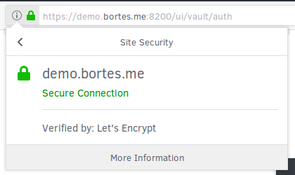

# Instalar Vault

Instalação do Vault versão v10.1.1.

## Requisitos

+ 2 CPU com 4 GB de RAM e 25 GB de espaço em disco - [sugerido aqui](https://www.hashicorp.com/resources/hashicorp-vault-administrative-guide)
+ Ubuntu 16.04 LTS ou superior
+ UnZip 6.00 ou superior

## TL;DR

Para facilitar, execute [este shell script](./SERVER_FILES/run.sh) que contém deste manual:

```bash
$ curl https://github.com/bortes/wiki/blob/master/VAULT/SERVER_FILES/run.sh | sudo bash
```

## Por que

Porque além de assegurar a persistência de um segredo ele possui por padrão:
+ um mecânismo para uma ação rápida quando o sistema for comprometido
+ registro de requisições inválidas
+ tokens para acessos
+ uma solução completa para gestão de segredos
+ integração com diversas ferramentas tanto para abertura/fechamento do cofre quanto para armazenamento de segredos

Além de tudo isso, ele é gratuíto.

## Repositório

> &nbsp;
> [Criaremos um usuário](../LINUX/USER.md) chamdo **vault**, grupo **vault**, para executar o Vault.
> &nbsp;

As configurações deverão ser salvas em **/etc/opt/hashicorp/vault**.

```bash
$ sudo mkdir -p /etc/opt/hashicorp/vault
```

Os arquivos irão ser salvos em **/var/opt/hashicorp/vault**.

```bash
$ sudo mkdir -p /var/opt/hashicorp/vault
```

Uma vez que o Vault não será executado com o usuário **root** devemos modificar o proprietário dos diretórios acima.

```bash
$ sudo chown vault:vault /etc/opt/hashicorp/vault /var/opt/hashicorp/vault
```

## Instalação

> &nbsp;
> Iremos no conectar ao Vault via TLS e para tanto devemos [criar um certificado](../TLS/README.md) para o DNS **demo.bortes.me**.
> &nbsp;

Primeiro repositório para o Vault.

```bash
$ sudo mkdir -p /opt/hashicorp/vault
```

Depois efetuar o download dos binários.

```bash
$ sudo wget https://releases.hashicorp.com/vault/0.10.1/vault_0.10.1_linux_amd64.zip -P /opt/hashicorp/vault
```

Após o termino do download, descompactaremos o arquivo obtido.

```bash
$ sudo unzip /opt/hashicorp/vault/vault_0.10.1_linux_amd64.zip -d /opt/hashicorp/vault/vault_0.10.1_linux_amd64
```

Em seguida, criaremos uma referência para a versão atual instalada no servidor.

```bash
$ sudo ln -s /opt/hashicorp/vault/vault_0.10.1_linux_amd64 /opt/hashicorp/vault/current
```

Então, criamos os links para os executáveis.

```bash
$ sudo find /opt/hashicorp/vault/current/ -type f -executable -exec sudo ln -s -f  {} /usr/local/bin/ \;
```

### certificados

Será necessário conceder permissão ao usuário **vault** para que ele tenha acessos aos certificados.

Neste exemplo, consideramos certificados criados com o comando **certbot**. Sendo assim, os certificados gerados encontram-se em **/etc/letsencrypt**.

Afim de conceder acesso, utilizaremos o comando **chmod** para expandir as permissões dos diretório.

```bash
$ sudo chmod o+x /etc/letsencrypt/archive /etc/letsencrypt/live
```

_Fonte: [Install Vault](https://www.vaultproject.io/docs/install/index.html)_

## Configuração

Para nossa configuração, é preciso determinar qual será o [tipo de armazenamento](https://www.vaultproject.io/docs/configuration/storage/index.html) utilizado dentre os diversos existentes.

Seguem alguns disponíveis:

+ [Azure](https://www.vaultproject.io/docs/configuration/storage/azure.html)
+ [Consul](https://www.vaultproject.io/docs/configuration/storage/consul.html)
+ [Filesystem](https://www.vaultproject.io/docs/configuration/storage/filesystem.html)
+ [Google Cloud Storage](https://www.vaultproject.io/docs/configuration/storage/google-cloud-storage.html)
+ [In-Memory](https://www.vaultproject.io/docs/configuration/storage/in-memory.html)
+ [PostgreSQL](https://www.vaultproject.io/docs/configuration/storage/postgresql.html)
+ [Cassandra](https://www.vaultproject.io/docs/configuration/storage/cassandra.html)
+ [Zookeeper](https://www.vaultproject.io/docs/configuration/storage/zookeeper.html)

Vamos armazenar os nossos segredos no **filesystem**, pois vamos empregar apenas um servidor com o qual não desejamos _alta disponibilidade_ apenas _persistência_.

_**ATENÇÃO**: por segurança, ALTERE A PORTA CRIE REGRAS de acesso aos segredos!_

_**IMPORTANTE**: é preciso habilitar o acesso externo as portas 8200!_

Primeiro, vamos criar o arquivo de configuração _/etc/opt/hashicorp/vault/config.hcl_ com o seguinte conteúdo:

```ini
# https://www.vaultproject.io/docs/configuration/storage/filesystem.html
storage "file" {
    path = "/var/opt/hashicorp/vault/data/file"
}

# https://www.vaultproject.io/docs/configuration/listener/tcp.html
listener "tcp" {
    address            = "0.0.0.0:8200"
    tls_client_ca_file = "/etc/letsencrypt/live/demo.bortes.me/chain.pem"
    tls_cert_file      = "/etc/letsencrypt/live/demo.bortes.me/fullchain.pem"
    tls_key_file       = "/etc/letsencrypt/live/demo.bortes.me/privkey.pem"
}

# https://www.vaultproject.io/docs/configuration/index.html
ui = true
```

Depois, o arquivo de politicas de acesso em _/etc/opt/hashicorp/vault/policy.hcl com o seguinte conteúdo:

```ini
# https://www.vaultproject.io/docs/concepts/policies.html#policy-syntax
path "secret/meus_segredos" {
    capabilities = ["read"]
}
```

## Execução

Por fim, o arquivo para execução do Vault com _serviço_ em _/etc/systemd/system/vault.service_ com o seguinte conteúdo:

```ini
[Unit]
# sobre
Description=Vault
# executar apos
After=network.target

[Service]
# comando que sera executado
ExecStart=/usr/local/bin/vault server -config=/etc/opt/hashicorp/vault/config.hcl
# usuario e grupo para execucao
User=vault
Group=vault
# nao espera ate a execucao do comando para identificar se o servico foi iniciado com sucesso
Type=simple
# define o caminho absoluto para o identificador do processo
PIDFile=/var/opt/hashicorp/vault/vault.pid
# regra para reiniciar o servico sempre que ele nao for terminado com sucesso - exit code 0
Restart=on-failure
# define um /tmp e /var/tmp especifico para o servico
PrivateTmp=true
# monta o /usr, o /boot e o /etc como somente leitura
ProtectSystem=full
# define que o servico e seus filhos nao pode ganhar novas permissoes
NoNewPrivileges=true
# define um /dev especifico para o servico
PrivateDevices=true
# mantem as capacidades do usuario ao processo mesmo que ele perca permissoes e por consequencia tenha capacidades reduzidas
SecureBits=keep-caps
# define as capacidades que serao permitidas aos processos que serao executados
AmbientCapabilities=CAP_IPC_LOCK CAP_NET_BIND_SERVICE
# adiciona ao usuario a capacidade de bloquear a memoria evitando o uso do swap
Capabilities=CAP_IPC_LOCK CAP_NET_BIND_SERVICE

[Install]
# aguardar
WantedBy=multi-user.target
```

Abriremos a seguinte portas:

+ 8200, acesso via UI e CLI

Continuando, concedemos permissão para execução do nosso _serviço_.

```bash
$ sudo chmod +751 /etc/systemd/system/vault.service
```

Ainda, devemos atualizar a lista de _serviços_ disponíveis no sistema operacional.

```bash
$ sudo systemctl daemon-reload
```

Logo após, ativamos o _serviço_.

```bash
$ sudo systemctl enable vault
```

Resultado:

```
Created symlink from /etc/systemd/system/multi-user.target.wants/vault.service to /etc/systemd/system/vault.service.
```

Finalmente, inicializamos ele.

```bash
$ sudo systemctl start vault
```

Podemos consultamos o estado do _serviço_:

```bash
$ systemctl status vault
```

Caso o _serviço_ esteja funcionando corretamente, o resultado será:

```
● vault.service - Vault Server
   Loaded: loaded (/etc/systemd/system/vault.service; enabled; vendor preset: enabled)
   Active: active (running) since Mon 2018-06-04 19:49:51 UTC; 8s ago
 Main PID: 12419 (vault)
    Tasks: 7
   Memory: 9.6M
      CPU: 32ms
   CGroup: /system.slice/vault.service
           └─12419 /usr/local/bin/vault server -config=/etc/opt/hashicorp/vault/config.hcl

Jun 04 19:49:51 vault systemd[1]: Started Vault Server.
```

**PRONTO!** NOSSO VAULT ESTÁ EM EXECUÇÃO, MAS NÃO INICIALIZADO. SENDO ASSIM AINDA **NÂO ESTÁ PRONTO PARA UTILIZAR**.

Podemos também confirmar o sucesso utilizando o comando **netstat** para verificar se as portas utilizadas estão abertas:

```bash
$ netstat -tnlp | grep LIST
```

Resultado:

```
Not all processes could be identified, non-owned process info
 will not be shown, you would have to be root to see it all.)
tcp        0      0 0.0.0.0:22              0.0.0.0:*               LISTEN      -
tcp        0      0 0.0.0.0:443             0.0.0.0:*               LISTEN      -
tcp6       0      0 :::22                   :::*                    LISTEN      -
```

Para confirmar se o **Vault** está ativo, podemos utilizar o comando **curl**.

```bash
$ curl -v https://demo.bortes.me:8200
```

Resultado (apenas os dados do certificado):

```
* Rebuilt URL to: https://demo.bortes.me:8200/
*   Trying 35.231.76.96...
* TCP_NODELAY set
* Connected to demo.bortes.me (35.231.76.96) port 8200 (#0)
* ALPN, offering h2
* ALPN, offering http/1.1
* Cipher selection: ALL:!EXPORT:!EXPORT40:!EXPORT56:!aNULL:!LOW:!RC4:@STRENGTH
* successfully set certificate verify locations:
*   CAfile: /etc/ssl/certs/ca-certificates.crt
  CApath: none
* TLSv1.2 (OUT), TLS header, Certificate Status (22):
* TLSv1.2 (OUT), TLS handshake, Client hello (1):
* TLSv1.2 (IN), TLS handshake, Server hello (2):
* TLSv1.2 (IN), TLS handshake, Certificate (11):
* TLSv1.2 (IN), TLS handshake, Server key exchange (12):
* TLSv1.2 (IN), TLS handshake, Request CERT (13):
* TLSv1.2 (IN), TLS handshake, Server finished (14):
* TLSv1.2 (OUT), TLS handshake, Certificate (11):
* TLSv1.2 (OUT), TLS handshake, Client key exchange (16):
* TLSv1.2 (OUT), TLS change cipher, Client hello (1):
* TLSv1.2 (OUT), TLS handshake, Finished (20):
* TLSv1.2 (IN), TLS change cipher, Client hello (1):
* TLSv1.2 (IN), TLS handshake, Finished (20):
* SSL connection using TLSv1.2 / ECDHE-RSA-AES256-GCM-SHA384
* ALPN, server accepted to use h2
* Server certificate:
*  subject: CN=demo.bortes.me
*  start date: Jun  4 19:06:36 2018 GMT
*  expire date: Sep  2 19:06:36 2018 GMT
*  subjectAltName: host "demo.bortes.me" matched cert's "demo.bortes.me"
*  issuer: C=US; O=Let's Encrypt; CN=Let's Encrypt Authority X3
*  SSL certificate verify ok.
* Using HTTP2, server supports multi-use
* Connection state changed (HTTP/2 confirmed)
* Copying HTTP/2 data in stream buffer to connection buffer after upgrade: len=0
* Using Stream ID: 1 (easy handle 0x22c1520)
```

Ou acessando via browser.



_Fonte: [HashiCorp Vault Administrative Guide](https://www.hashicorp.com/resources/hashicorp-vault-administrative-guide)_
